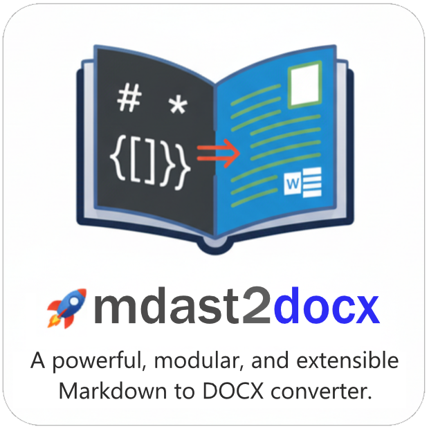

# **MDAST (Markdown Abstract Syntax Tree) to DOCX** 

**🚀 A powerful, modular, and extensible Markdown to DOCX converter.**

<p align="center">
  
</p>

MD2DOCX is a robust library for converting Markdown Abstract Syntax Trees (MDAST) into DOCX documents. Built on the powerful `unified.js` and `docx.js` ecosystems, it offers a flexible, plugin-driven architecture that works seamlessly on both the client and server.

[](https://github.com/md2docx/mdast2docx/actions/workflows/test.yml)
[](https://codeclimate.com/github/md2docx/mdast2docx/maintainability)
[](https://codecov.io/gh/md2docx/mdast2docx)
[](https://www.npmjs.com/package/mdast2docx)
[](https://www.npmjs.com/package/mdast2docx)


---

## ✨ Key Features

- **Modular Architecture**: Keep your bundles small. The core is lightweight, and you can add features like tables, images, or math support via plugins.
- **Comprehensive Markdown Support**: Handles all standard Markdown syntax, including headings, lists, links, code blocks, and more.
- **Client & Server Ready**: Isomorphic design works flawlessly in both Node.js and browser environments.
- **Highly Customizable**: Leverage the full power of `docx.js` to style your document, including headers, footers, margins, and paragraph styles.
- **Scoped Packages**: Install only what you need using `@m2d/*` packages, or grab the all-in-one `mdast2docx` package.

---

## 🤖 The Generative AI Power-Up

Modern **Generative AI** tools often produce structured content in **Markdown**. This library acts as the perfect bridge to convert AI-generated artifacts into professionally formatted DOCX documents for editing, sharing, or record-keeping.

**Workflow:** `AI Output (Markdown)` → `unified/remark (MDAST)` → `mdast2docx` → `Professional DOCX Document`

- **AI-Generated Reports**: Convert AI-generated summaries and reports into polished DOCX files.
- **Content Export**: Transform AI-generated blogs, articles, and research into an editable DOCX format.
- **Flexible Processing**: Offload document generation to the client for scalability or run it on the server for high-performance batch processing.

---

## 📦 Installation

You can install the all-in-one package or select only the scoped packages you need.

### **Install Everything at Once**

```bash
pnpm add mdast2docx
```

### **Or Install Only What You Need**

```bash
pnpm add @m2d/core @m2d/image @m2d/table  # and other plugins
```

---

## 🚀 Usage

You can use the library at a high level with `@m2d/remark-docx` for seamless integration with unified plugin system or at a lower level with `@m2d/core` + plugins ro `mdast2docx` for full control.

### **Basic Example**

This example uses the core `toDocx` function to convert an MDAST object into a DOCX file and trigger a download in the browser.

```typescript
import { toDocx } from "mdast2docx";
import { unified } from "unified";
import remarkParse from "remark-parse";

// 1. Your Markdown content
const markdown = `
# Sample Document
This is a paragraph with **bold** and _italic_ text.

> A blockquote.

* List Item 1
* List Item 2

[Visit our website](https://example.com)
`;

// 2. Parse Markdown to MDAST
const mdast = unified().use(remarkParse).parse(markdown);

// 3. Convert MDAST to DOCX and download
async function generateDocx() {
  const docxBlob = await toDocx(mdast);

  // Create a download link
  const url = URL.createObjectURL(docxBlob as Blob);
  const link = document.createElement("a");
  link.href = url;
  link.download = "document.docx";
  document.body.appendChild(link);
  link.click();
  document.body.removeChild(link);
  URL.revokeObjectURL(url);
}

generateDocx();
```

---

## 🔌 Plugins

The core library is intentionally lean. Use plugins to add support for features like images, tables, math equations, and more.

### **Example: Using Plugins**

To use plugins, install them and pass them into the configuration. You can apply plugins globally to all sections using defaultSectionProps or specify them for each section individually.

```typescript
import { toDocx } from "@m2d/core";
import { imagePlugin } from "@m2d/image";
import { tablePlugin } from "@m2d/table";
import { mathPlugin } from "@m2d/math";
import { unified } from "unified";
import remarkParse from "remark-parse";
import remarkGfm from "remark-gfm"; // For table support
import remarkMath from "remark-math"; // For math support

const markdownWithFeatures = `
An image: 

| Header 1 | Header 2 |
|----------|----------|
| Cell 1   | Cell 2   |

A math equation: $E = mc^2$
`;

const mdast = unified()
  .use(remarkParse)
  .use(remarkGfm) // Enable GFM for tables
  .use(remarkMath) // Enable math syntax
  .parse(markdownWithFeatures);

(async () => {
  const docxBlob = await toDocx(
    mdast,
    {}, // docxProps
    {
      // Pass plugins in sectionProps
      plugins: [imagePlugin(), tablePlugin(), mathPlugin()],
    }
  );
  // ... download logic ...
})();
```

---

## 📜 API Reference

### **`toDocx(astInputs, docxProps?, sectionProps?, outputType?)`**

Converts one or more MDAST trees into a DOCX document.

| Parameter      | Type            | Description                                                                                                                             |
| :------------- | :-------------- | :-------------------------------------------------------------------------------------------------------------------------------------- | ------------------------------------------------------------------------------------- | ---------------------------------------------------------------------------------------- |
| `astInputs`    | `Root`          | `{ ast: Root; props?: ISectionProps }[]`                                                                                                | A single MDAST root node or an array of nodes, each with optional section properties. |
| `docxProps`    | `IDocxProps`    | Optional. Global document properties like title, author, and styles. See [docx.js docs](https://docx.js.org/#/usage/document).          |
| `sectionProps` | `ISectionProps` | Optional. Default properties for document sections, like margins and plugins. See [docx.js docs](https://docx.js.org/#/usage/sections). |
| `outputType`   | `"blob"`        | `"buffer"`                                                                                                                              | `"base64"`                                                                            | Optional. The output format. Defaults to `"blob"` in browsers and `"buffer"` in Node.js. |

**Returns:** `Promise<Blob | Buffer | string>` — A promise that resolves with the generated DOCX document in the specified format.

---

## ✅ Supported Markdown Elements

| Feature                | Supported | Plugin Required |
| :--------------------- | :-------: | :-------------- |
| Headings (`# H1`)      |    ✅     | **No**          |
| Paragraphs             |    ✅     | **No**          |
| Bold & Italic          |    ✅     | **No**          |
| Blockquotes            |    ✅     | **No**          |
| Links                  |    ✅     | **No**          |
| Code Blocks            |    ✅     | **No**          |
| Footnotes              |    ✅     | **No**          |
| Unordered Lists        |    ✅     | **No**          |
| Images ``   |    ✅     | `@m2d/image`    |
| Tables (GFM)           |    ✅     | `@m2d/table`    |
| Ordered Lists          |    ✅     | `@m2d/list`     |
| Math Equations (LaTeX) |    ✅     | `@m2d/math`     |
| Raw HTML               |    ✅     | `@m2d/html`     |

---

## 🤝 Contributing

We welcome contributions\! Please feel free to fork the repository, create a feature branch, and open a pull request.

1.  **Fork** the repository.
2.  **Create a feature branch** (`git checkout -b feature/your-new-feature`).
3.  **Commit your changes** (`git commit -m "Add a new feature"`).
4.  **Push to the branch** (`git push origin feature/your-new-feature`).
5.  **Open a Pull Request**. 🚀

---

## 📄 License

This project is licensed under the **MPL-2.0**. See the [LICENSE](./LICENSE) file for details.

---

## 🙌 Acknowledgments

A huge thank you to the creators and maintainers of the **docx.js** and **unified.js** ecosystems, which make this library possible.

> ⭐ **Star this repository** if you find it useful!  
> ❤️ Support our work by [sponsoring on GitHub](https://github.com/sponsors/mayank1513).

---

<p align="center">Made with 💖 by <a href="https://mayank-chaudhari.vercel.app" target="_blank">Mayank Kumar Chaudhari</a></p>
