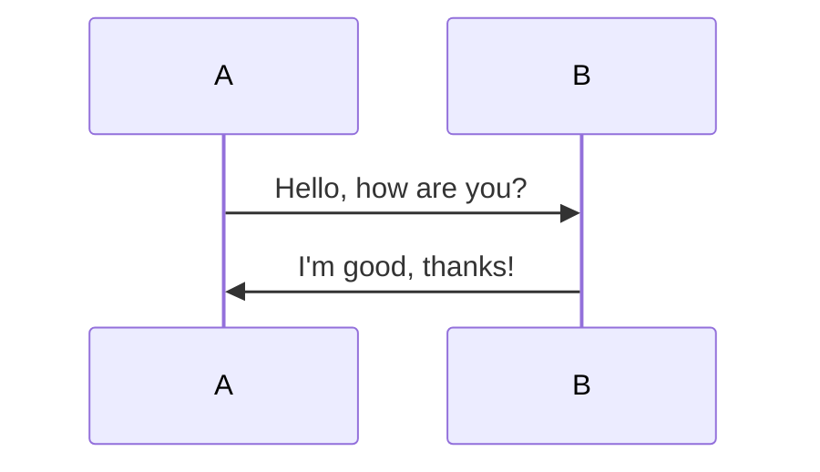
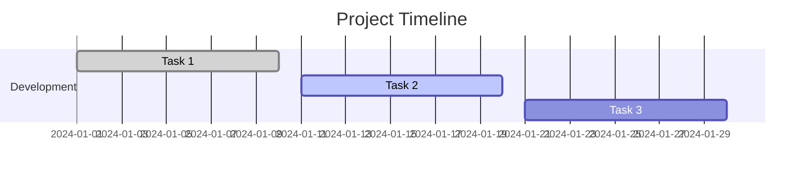

# Markdown Syntax Showcase

## Table of Contents

- [Basic Elements](#1-basic-elements)
  - [Headings](#headings)
  - [Text Formatting](#text-formatting)
  - [Blockquote](#blockquote)
  - [Horizontal Rule](#horizontal-rule)
- [Lists](#2-lists)
  - [Unordered List](#unordered-list)
  - [Ordered List](#ordered-list)
- [Code Blocks](#3-code-blocks)
- [Tables](#4-tables)
- [Links and Images](#5-links-and-images)
- [Task Lists](#6-task-lists-gfm)
- [Footnotes](#7-footnotes)
- [Emoji](#8-emoji-gfm)
- [Math Equations](#9-math-equations-katex--latex)
- [Diagrams](#10-diagrams-mermaid)
- [Definition Lists](#11-definition-lists)
- [Admonitions](#12-admonitions-callouts)
- [HTML Elements](#13-html-elements)
- [Custom Directives](#14-custom-directives-mdx)

## 1. Basic Elements

### Headings

Different levels of headings for structuring content.

# Heading 1

The largest heading, usually reserved for the main title of the document.

## Heading 2

A subheading, used to separate major sections.

### Heading 3

A smaller heading, often used for subsections.

#### Heading 4

A more detailed subsection heading.

##### Heading 5

A minor heading, used for further breakdown.

###### Heading 6

The smallest heading, typically used for fine details.

> #### Nested Blockquote Example
>
> > ##### Nested Blockquote Level 2
> >
> > - List inside a blockquote:
> >   - **Bold Text** inside a list
> >   - `Inline Code` inside a list
> >
> > ```javascript
> > console.log("Code inside a blockquote list");
> > ```

### Text Formatting

- **Bold text `with code`**
- _Italic text_
- ~~Strikethrough~~
- `Inline code`

### Blockquote

> This is a **nested blockquote** example.
>
> > Another level of nesting.
> >
> > - List item 1
> > - List item 2
> >   - Subitem inside blockquote
> >
> > ```python
> > def nested_function():
> >     return "Code inside nested blockquote"
> > ```

### Horizontal Rule

---

## 2. Lists

### Unordered List

- Item 1
- Item 2
  - Subitem 1
  - Subitem 2
- Item 3

### Ordered List

1. First item
2. Second item
   1. Subitem 1
   2. Subitem 2
3. Third item

## 3. Code Blocks

### JavaScript Example

```javascript
function greet(name) {
  console.log(`Hello, ${name}!`);
}
greet("Mayank");
```

### Python Example

```python
def greet(name):
    print(f"Hello, {name}!")

greet("Mayank")
```

## 4. Tables

Structuring data in tabular format.

| Name  | Age | Location      |
| ----- | --- | ------------- |
| John  | 25  | New York      |
| Alice | 30  | San Francisco |
| Bob   | 28  | London        |

## 5. Links and Images

Adding hyperlinks and images.

### External Links

[OpenAI](https://openai.com)

### Internal Links

[Back to Table of Contents](#table-of-contents)

### Images

Embedding images in Markdown.


Another example:


Additional image example:


### Reference Links in Markdown

This is an example of using reference-style links in Markdown.

You can define a reference link like this\
[OpenAI][openai] is an AI research and deployment company.

Markdown syntax is explained in detail on [Markdown Guide][md-guide].

#### References

[openai]: https://openai.com "OpenAI Website"
[md-guide]: https://www.markdownguide.org "Markdown Guide"

## 6. Task Lists (GFM)

Checkable task lists.

- [x] Task 1 - Completed
- [ ] Task 2 - Pending
- [ ] Task 3 - Pending
  - [x] Subtask 3.1 - Done
  - [ ] Subtask 3.2 - Pending
- [ ] Task 4 - In Progress
- [ ] Task 5 - Pending Review
- [x] Task 6 - Approved

Task lists are useful for tracking progress in projects.

## 7. Footnotes

Referencing additional information.

Here is a statement with a footnote.[^1]

[^1]: This is the footnote content.

## 8. Emoji (GFM)

Using emojis in Markdown.

:smile: :rocket: :tada: :fire: :computer:

## 9. Math Equations (KaTeX / LaTeX)

Displaying mathematical expressions.

Inline equation: $E=mc^2$

Block equation:

$$
\sum_{n=1}^{\infty} \frac{1}{n^2} = \frac{\pi^2}{6}
$$

## 10. Diagrams (Mermaid)

Visualizing data with diagrams.

### Flowchart


### Sequence Diagram



### Mindmap

```mindmap
- Root
  - Branch 1
    - Subbranch 1
    - Subbranch 2
  - Branch 2
    - Subbranch 3
    - Subbranch 4
```

### Chart (Gantt)



## 11. Definition Lists

Defining terms and meanings.

Term 1  
: Definition 1

Term 2  
: Definition 2a  
: Definition 2b

## 12. Admonitions (Callouts)

Highlighting important notes or warnings.

> **Note:** This is an important note.
>
> **Warning:** Be careful with this step!

## 13. HTML Elements

Using HTML for additional interactivity.

<details>
  <summary>Click to expand</summary>
  This is hidden content.
</details>

### 13.1. Inline HTML

This is an example of **inline HTML** inside a paragraph:

This is a <span style="color: red; font-weight: bold;">red bold text</span> inside a Markdown paragraph.

You can also add **inline images**:


Or create **inline links** with styles:

<a href="https://openai.com" target="_blank" style="color: blue; text-decoration: none; font-weight: bold;">Visit OpenAI</a>

### 13.2. Block HTML Elements

#### Tables with HTML

<table border="1" cellspacing="0" cellpadding="10">
    <tr>
        <th>Name</th>
        <th>Age</th>
        <th>Location</th>
    </tr>
    <tr>
        <td>John</td>
        <td>25</td>
        <td>New York</td>
    </tr>
    <tr>
        <td>Alice</td>
        <td>30</td>
        <td>San Francisco</td>
    </tr>
</table>

#### Forms in HTML

<form action="#" method="post">
    <label for="name">Name:</label>
    <input type="text" id="name" name="name" /><br><br>
    
    <label for="email">Email:</label>
    <input type="email" id="email" name="email" /><br><br>
    
    <input type="submit" value="Submit" />
</form>

### 13.3. Combining Markdown and HTML

> This is a **blockquote** with an embedded **HTML table**:
>
> <table border="1">
>   <tr>
>     <th>Feature</th>
>     <th>Supported</th>
>   </tr>
>   <tr>
>     <td>Markdown</td>
>     <td>✅</td>
>   </tr>
>   <tr>
>     <td>HTML</td>
>     <td>✅</td>
>   </tr>
> </table>

### 13.4. Custom Styling

<style>
    table {
        border-collapse: collapse;
        width: 100%;
    }
    th, td {
        border: 1px solid black;
        padding: 8px;
        text-align: left;
    }
    th {
        background-color: #f2f2f2;
    }
</style>

## 14. Custom Directives (MDX)

Embedding custom components.

```mdx
<MyComponent title="Hello World" />
```

---

This document covers most of the syntax supported by `mdast`, including extended Markdown features such as GFM, math, diagrams, and MDX components.
